# Pizza-Sale-s-Report

## Problem Statement From Client
These project used a dataset from Data Tutorials - an instructor from Youtube.
## KPI's Requirement
The Data Analyst need to analyze key indicators for pizza sales data to gain insights into business performance. <br>
Specifically, the client want to calculate the following metrics: <br>
**1. Total Revenue:** The sum of the total prize of all pizza orders. <br>
**2. Average Order Value:** The average amount spent per order, calculated by dividing the total revenue by the total number of orders. <br>
**3. Total Pizzas Sold:** The sum of the quantities of all pizzas sold. <br>
**4. Total Orders:** The total number of orders placed. <br>
**5. Average Pizzas Per Order:** The average number of pizzas sold per order, calculated by dividing the total number of pizzas sold by the total number of orders. <br>

## Charts Requirement
The client want to visualize various aspects of pizza sales data to gain insights and understand key trends. Here are the following requirements for creating charts: <br>
**1. Daily Trend for Total Orders:** Create a bar chart that displays the daily trend of total orders over a specific time period. This chart will help to identify any patterns or fluctuations in order volumes in daily bases. <br>
**2. Monthly Trend for Total Orders:** Create a line chart that illustrates the hourly trend of total orders throughout the day. This chart will allow to identify  peak  hours or periods of high order activity. <br>
**3. Percentage of Sales by Pizza Category:** Create a pie chart that shows the distribution of sales across different pizzas categories. This chart will provide insights into the popularity of various pizza categories and their contribution to overall sales. <br>
**4. Percentage of Sales by Pizza Size:** Generate a pie chart that represent the percentage of sales attributed to different pizzas sizes. This chart will help to to understand customer preferences for pizza sizes and their impact on sales. <br>
**5. Total Pizzas Sold by Category:** Create a funnel chart that presents the total number of pizzas sold for each pizza category. This chart will allow to compare the sales performance of different pizza categories. <br>
**6. Top 5 best Sellers by Revenue, Total Quantity, and Total Orders:** Create a bar chart highlighting the top 5 best-selling pizzas based on the revenue, total quantity, total orders. This chart will help to identify the most popular pizza options. <br>
**7. Bottom 5 Worst Sellers by Revenue, Total Quantity and Total Orders:** Create a bar chart showcasing the bottom 5 worst-selling pizzas based on the revenue, total quantity, total orders. This chart will identify underperforming or less popular pizza options. <br>

## Documentation of Workflow
1. Using SQL Server, I created database called **Pizza_Sales_DB**. <br>
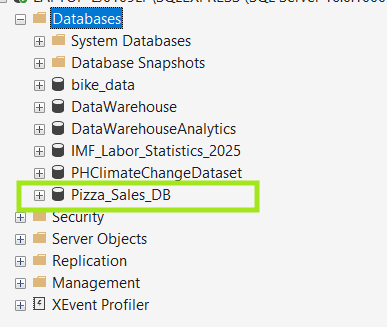 <br>
2. Next, I imported the .csv file of pizza_sales to the database. <br>
 <br>
3. I create a Query for KPI's Requirement. <br>
a. **Total Revenue** <br>
```sql
SELECT CAST(SUM(total_price) AS DECIMAL(15,2)) AS Total_Revenue 
FROM pizza_sales;
``` 
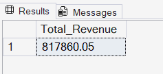 <br>
b. **Average Order Value** <br>
```sql
SELECT CAST(SUM(total_price) / COUNT(DISTINCT order_id) AS DECIMAL(15,2)) Average_Order_Value
FROM pizza_sales;
```
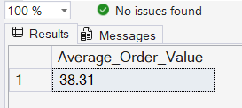 <br>
c. **Total Pizzas Sold** <br>
```sql
SELECT SUM(quantity) AS Total_Pizza_Sold FROM pizza_sales;
```
 <br>
d. **Total Orders**
```sql
SELECT COUNT(DISTINCT order_id) AS Total_Orders FROM pizza_sales;
```
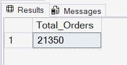
<br>
e. **Average Pizzas Per Order** <br>
```sql
SELECT CAST(CAST(SUM(quantity) AS DECIMAL(10,2)) / CAST(COUNT(DISTINCT order_id) AS DECIMAL(10,2)) AS DECIMAL(10,2))
AS Average_Pizza_per_Order
FROM  pizza_sales;
```
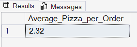 <br>
4. SQL query for Charts Reguirement
a. **Daily Trend for Total Orders** <br>
```sql
SELECT DATENAME(DW, order_date) AS order_day, 
COUNT(DISTINCT order_id) AS Total_Orders
FROM pizza_sales
GROUP BY DATENAME(DW, order_date);
```
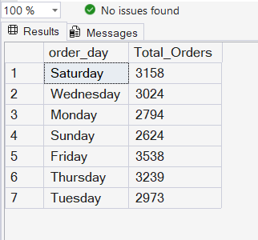 <br>
b. **Monthly Trend for Total Orders** <br>
```sql
SELECT DATENAME(MONTH, order_date) AS order_day, 
COUNT(DISTINCT order_id) AS Total_Orders
FROM pizza_sales
GROUP BY DATENAME(MONTH, order_date)
ORDER BY Total_Orders DESC;
```
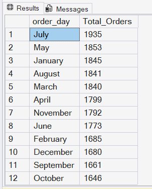
c. **Percentage of Sales by Pizza Category** <br>
```sql
SELECT pizza_category, 
CAST(SUM(total_price) AS DECIMAL(10,2)) AS Total_Sales, 
CAST(SUM(total_price) * 100 /(SELECT sum(total_price) 
from pizza_sales WHERE MONTH(order_date) = 1) AS DECIMAL(10,2)) AS Percent_Total
FROM pizza_sales
WHERE MONTH(order_date) = 1
GROUP BY pizza_category;
```
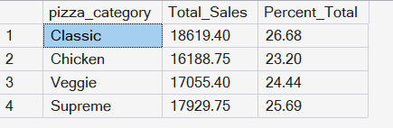 <br>
d. **Percentage of Sales by Pizza Size**
```sql
SELECT pizza_size, 
CAST(SUM(total_price) AS DECIMAL(10,2)) AS Total_Sales, 
CAST(SUM(total_price) * 100 /(SELECT sum(total_price) 
from pizza_sales WHERE DATEPART(QUARTER, order_date) = 1) AS DECIMAL(10,2)) AS Percent_Total
FROM pizza_sales
WHERE DATEPART(QUARTER, order_date) = 1
GROUP BY pizza_size
ORDER BY Percent_Total DESC;
```
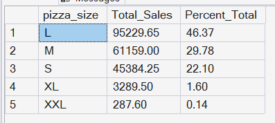 <br>
e. **Total Pizzas Sold by Category** This problem statement was querried in letter C **Percentage of Sales by Pizza Category** <br>
f. **Top 5 best Sellers by Revenue, Total Quantity, and Total Orders**
```sql
--Top 5 Total Revenue
SELECT TOP 5 pizza_name, CAST(SUM(total_price) AS DECIMAL(10,2)) AS Revenue
FROM pizza_sales
GROUP BY pizza_name
ORDER BY Revenue DESC;
```
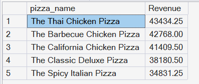 <br>
```sql
--Top 5 Total Quantity
SELECT TOP 5 pizza_name, 
SUM(quantity) AS Total_Quantity
FROM pizza_sales
GROUP BY pizza_name
ORDER BY Total_Quantity DESC;
```
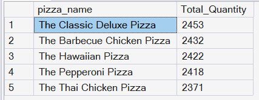 <br>
```sql
--Top 5 Total Orders
SELECT TOP 5 pizza_name, COUNT(DISTINCT order_id) AS Total_Orders
FROM pizza_sales
GROUP BY pizza_name
ORDER BY Total_Orders DESC;
```
 <br>
g. **Bottom 5 Worst Sellers by Revenue, Total Quantity and Total Orders**
To get the bottom 5 of the total revenue, total quantity and total orders, just change the argument in ORDER BY from **DESC** to **ASC**.

## Data Visualization using PowerBI


